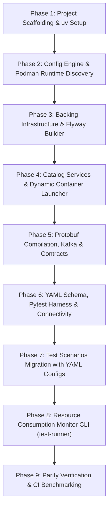

# Refactoring Plan: Integration Suite Migration to Python

This document details the architectural design, technology stack, and high-level execution roadmap to refactor the Go-based multi-repository integration testing harness (`./../integration-suite`) into an idiomatic, high-performance Python platform (`integration-py`).

For the granular, phased engineering task checklist, refer to [TASKS.md](file:///Users/muktiwibowo/Documents/NV/dev/integration-py/TASKS.md).

---

## 1. Executive Summary & Migration Objectives

The existing Go platform (`integration-suite`) provides an automated, scenario-scoped harness for validating multi-service logistics workflows (such as `sort-mistake` and `sort-service`) against real containerized infrastructure (MySQL 8.0, Apache Kafka 7.6.0, Redis 7, WireMock, and Flyway migrations) running on rootless Podman.

### Objectives of the Python Refactoring
1. **Developer Velocity & Expressiveness**: Leverage Python's rich testing ecosystem (`pytest`, dynamic fixtures, expressive assertions) to reduce boilerplate for writing and extending integration tests.
2. **Modern Tooling**:
   - **`uv`**: Fast, single-binary Python package and project manager (replacing `go.mod`, `pip`, and `poetry`).
   - **`just`**: Modern, cross-platform command runner (replacing GNU `Makefile`).
3. **Declarative YAML Scenarios**: Replace code-based scenario config (`config.go`/`config.py`) with clean, declarative **`config.yaml`** files in each test directory, auto-discovered by the Pytest harness and bound to Pydantic models.
4. **Architecture Preservation**: Retain 100% of the proven architectural patterns from the Go implementation:
   - **Scenario-Level Granularity**: Spin up only what each scenario declares in its `config.yaml`.
   - **Zero Host Collisions**: Dynamic ephemeral port binding on `127.0.0.1:<random>`.
   - **Rootless Podman Support**: Automatic socket discovery (`podman machine inspect`) and Ryuk bypass.
   - **Safe Pruning**: Target only containers stamped with `label=harness.managed=true` without touching images.
   - **Ephemeral Flyway Migrations**: Mount microservice migration files (`resources/db/migration`) directly to avoid schema drift.
   - **Contract & Partial Testing**: Producer-only and consumer-only test isolation for 50%+ resource savings.
   - **High-Fidelity Resource Monitoring**: Full host process & container metrics reporting on every test run.

---

## 2. Technology Stack & Component Mapping

| Architectural Concern | Existing Go Implementation | Target Python Implementation | Notes / Tradeoffs |
|---|---|---|---|
| **Project & Dependency Management** | `go.mod` / `go.sum` | **`uv`** (`pyproject.toml`, `uv.lock`) | Blazing fast virtualenv creation, PEP 621 compliant, deterministic lockfile. |
| **Task Automation / Command Runner** | GNU `Makefile` | **`just`** (`justfile`) | Modern recipe syntax, native `.env` loading, clean parameter handling. |
| **Scenario Configuration** | Go code (`config.go`) | **Declarative YAML** (`config.yaml`) | Language-agnostic, zero test boilerplate, auto-loaded by Pytest fixtures into Pydantic. |
| **Test Framework** | Go standard `testing` + `testify` | **`pytest`** (`pytest-timeout`, `pytest-subtests`) | Powerful fixture scopes (session, function), clean assertions, parametrization. |
| **Container Orchestration** | `testcontainers-go` + Docker SDK | `testcontainers-python` + `docker` (Python SDK) | Controls Podman via Unix domain socket (`DOCKER_HOST`). |
| **Configuration Management** | `gopkg.in/yaml.v3` + custom upward walker | `pydantic` + `pydantic-settings` + `PyYAML` | Strong schema validation, upwards folder traversal for root `config.yaml` and `.env`. |
| **Relational Database Access** | `database/sql` + `go-sql-driver/mysql` | `PyMySQL` / `SQLAlchemy` (Core connection pool) | Fast pure-Python or C-optimized MySQL connectivity and table truncation. |
| **Distributed Cache Access** | `github.com/redis/go-redis/v9` | `redis` (`redis-py`) | Hash retrieval, cache clearing, connection pooling. |
| **Message Broker (Kafka)** | `github.com/segmentio/kafka-go` | `confluent-kafka` (librdkafka wrapper) | High-performance topic administration, exact binary protobuf serialization. |
| **Protobuf Handling** | `google.golang.org/protobuf` + `protoc-gen-go` | `protobuf` + `grpcio-tools` / `protoc` | Generates `*_pb2.py` files with dev-time compilation (`just proto-gen`). |
| **HTTP Mocking & Assertion** | `net/http` + WireMock REST API | `httpx` (or `requests`) | Clean synchronous client for WireMock mapping registration and API tests. |
| **Asynchronous Assertions** | `assert.Eventually` polling loop | `tenacity` or custom `eventually` helper | Polls predicates until condition holds or timeout expires. |
| **Resource Consumption Monitor** | `cmd/test-runner/main.go` (`syscall.Rusage` + Podman stats) | Python CLI (`psutil` + Podman stats JSON streamer) | Identical ASCII summary report of CPU, RSS, I/O, PIDs, and storage deltas. |

---

## 3. Target Directory & Package Structure

```text
integration-py/
├── .env.example                     # Environment template for local repo paths & image tags
├── config.yaml                      # Centralized backing image versions and Podman binary path
├── justfile                         # Unified task runner recipes (replacing Makefile)
├── pyproject.toml                   # Project dependencies, tools, and build configuration (uv)
├── uv.lock                          # Deterministic lockfile generated by uv
├── REFACTOR.md                      # High-level architectural plan and design rationale
├── TASKS.md                         # Detailed, phased task-by-task engineering checklist
├── docker/                          # Containerfiles for local service builds
│   ├── sort-mistake.Containerfile
│   └── sort-service.Containerfile
├── proto/                           # Protobuf schemas & generated Python modules
│   ├── __init__.py
│   └── protos_sort/                 # Sanitized SBT project namespace (e.g. protos-sort -> protos_sort)
│       ├── __init__.py
│       └── sortmistake/             # Exact path under canonical repo src/main/protobuf/
│           ├── __init__.py
│           ├── sort_node.proto      # Synced canonical schema
│           ├── sort_node_pb2.py     # Generated Python bindings (just proto-gen)
│           └── sort_node_pb2.pyi    # Generated typing stubs
├── src/
│   └── harness/           # Core harness library
│       ├── __init__.py
│       ├── config.py                # Upward-walking config.yaml & .env loader (Pydantic)
│       ├── catalog/                 # Declarative application service definitions
│       │   ├── __init__.py
│       │   ├── service.py           # ServiceDefinition dataclass & StartService runner
│       │   ├── sort_mistake.py      # SortMistake service spec
│       │   └── sort_service.py      # SortService service spec
│       ├── env/                     # Container runtime & infrastructure builders
│       │   ├── __init__.py
│       │   ├── podman.py            # Podman socket discovery & DOCKER_HOST configuration
│       │   ├── prune.py             # Safe managed container pruning (label=harness.managed=true)
│       │   ├── builder.py           # Fluent Builder for MySQL, Kafka, Redis, WireMock, Flyway
│       │   └── environment.py       # Managed runtime environment, client pools, teardown
│       ├── testutil/                # Low-level infrastructure helper modules
│       │   ├── __init__.py
│       │   ├── db.py                # MySQL pool connection, table truncation, row queries
│       │   ├── kafka.py             # Topic administration, proto reader/writer
│       │   ├── redis.py             # Redis client connection, cache flush, hash query
│       │   ├── mock_aaa.py          # WireMock OAuth/AAA token validation stubs
│       │   └── polling.py           # `eventually` polling helper (replacing assert.Eventually)
│       ├── contract/                # Schema and semantic contract verification
│       │   ├── __init__.py
│       │   ├── fixtures.py          # Synthetic contract protobuf event generators
│       │   └── sortmistake.py       # Invariant validators for SortNode event contracts
│       └── runner/                  # Resource consumption monitor CLI
│           ├── __init__.py
│           ├── cli.py               # CLI entrypoint wrapping test executions
│           ├── monitor.py           # Background sampling of psutil and Podman stats
│           └── reporter.py          # ASCII table formatter
└── tests/                           # Pytest integration scenarios
    ├── conftest.py                  # Global pytest fixtures (scenario loader, log dumping on failure)
    ├── common/
    │   ├── __init__.py
    │   ├── schema.py                # Pydantic schema & loader for scenario config.yaml
    │   ├── harness.py               # setup_scenario fixture orchestrator
    │   └── connectivity.py          # Automated sanity checks (subtests)
    ├── e2e/
    │   └── intra_node/              # Full multi-repo pipeline test
    │       ├── config.yaml          # Declarative scenario dependencies in YAML
    │       └── test_sort_task_pipeline.py
    ├── producer/
    │   └── intra_node/              # Producer-only isolated contract test
    │       ├── config.yaml          # Declarative scenario dependencies in YAML
    │       └── test_producer_pipeline.py
    └── consumer/
        └── intra_node/              # Consumer-only isolated contract test
            ├── config.yaml          # Declarative scenario dependencies in YAML
            └── test_consumer_ingestion.py
```

---

## 4. Dependency Management with `uv`

### 4.1. `pyproject.toml` Configuration
`uv` will manage all project metadata, Python runtime versions, runtime dependencies, and development tools:

```toml
[project]
name = "integration-suite"
version = "0.1.0"
description = "Multi-Repo Integration Testing Platform for Ninja Van microservices"
readme = "README.md"
requires-python = ">=3.12"
dependencies = [
    "pydantic>=2.7.0",
    "pydantic-settings>=2.2.0",
    "pyyaml>=6.0.1",
    "python-dotenv>=1.0.1",
    "docker>=7.1.0",
    "testcontainers>=4.4.0",
    "pymysql>=1.1.0",
    "cryptography>=42.0.0",
    "redis>=5.0.4",
    "confluent-kafka>=2.4.0",
    "protobuf>=5.26.1",
    "httpx>=0.27.0",
    "psutil>=5.9.8",
    "tenacity>=8.3.0",
]

[project.optional-dependencies]
dev = [
    "pytest>=8.2.0",
    "pytest-timeout>=2.3.1",
    "pytest-subtests>=0.12.1",
    "pytest-xdist>=3.6.0",
    "grpcio-tools>=1.62.2",
    "ruff>=0.4.4",
    "mypy>=1.10.0",
    "types-pyyaml>=6.0.12",
    "types-redis>=4.6.0",
    "types-psutil>=5.9.5",
]

[project.scripts]
test-runner = "harness.runner.cli:main"
pull-images = "harness.runner.cli:pull_images_cli"

[build-system]
requires = ["hatchling"]
build-backend = "hatchling.build"

[tool.pytest.ini_options]
testpaths = ["tests"]
addopts = "-v --tb=short"
timeout = 900
markers = [
    "e2e: End-to-end integration tests across all microservices",
    "producer: Producer-isolated contract tests",
    "consumer: Consumer-isolated contract tests",
]

[tool.ruff]
line-length = 100
target-version = "py312"
```

### 4.2. Workflow Commands using `uv`
- **Install / Sync environment**: `uv sync --all-extras`
- **Add a dependency**: `uv add <package>`
- **Add a dev dependency**: `uv add --dev <package>`
- **Execute tools inside virtualenv**: `uv run pytest`, `uv run test-runner`
- **Lock dependencies**: `uv lock`

---

## 5. Task Automation with `just` (`justfile`)

The GNU `Makefile` will be completely replaced by an idiomatic `justfile`. `just` natively supports `.env` file loading, environment variables, default arguments, and clean command chaining.

### 5.1. `justfile` Implementation

```just
# Multi-Repo Integration Test Platform (justfile)
set dotenv-load := true
set shell := ["bash", "-c"]

# Configuration variables with environment fallbacks
CONFIG_PODMAN_BIN := `awk '/^[[:space:]]*bin:/ {print $2}' config.yaml 2>/dev/null | tr -d '"' | tr -d "'"`
export PODMAN_BIN := env_var_or_default("PODMAN_BIN", if CONFIG_PODMAN_BIN != "" { CONFIG_PODMAN_BIN } else { "/opt/podman/bin/podman" })
export PODMAN_SOCKET := `{{PODMAN_BIN}} machine inspect --format '{{.ConnectionInfo.PodmanSocket.Path}}' 2>/dev/null || true`
export DOCKER_HOST := env_var_or_default("DOCKER_HOST", if PODMAN_SOCKET != "" { "unix://" + PODMAN_SOCKET } else { "" })
export TESTCONTAINERS_RYUK_DISABLED := "true"

# Service repository directories and image tags
export SORT_MISTAKE_DIR := env_var_or_default("SORT_MISTAKE_DIR", "../sort-mistake")
export SORT_SERVICE_DIR := env_var_or_default("SORT_SERVICE_DIR", "../sort-service")
export SORT_MISTAKE_IMAGE := env_var_or_default("SORT_MISTAKE_IMAGE", "sort-mistake:latest")
export SORT_SERVICE_IMAGE := env_var_or_default("SORT_SERVICE_IMAGE", "sort-service:latest")

# Default recipe: display help
default:
    @just --list --unsorted

# Setup local Python virtual environment and dependencies using uv
setup:
    uv sync --all-extras
    @echo "Environment synced successfully via uv."

# Pre-pull public backing infrastructure images defined in config.yaml
pull-images:
    uv run pull-images

# Reusable private recipe to build a service image
[private]
build-service service_name repo_dir image_tag prebuild_cmd="":
    @if [ ! -d "{{repo_dir}}" ]; then \
        echo "ERROR: Directory '{{repo_dir}}' not found."; \
        echo "Please point $(echo {{service_name}} | tr '[:lower:]-' '[:upper:]_')_DIR in .env to your local checkout."; \
        exit 1; \
    fi
    @echo "Building {{image_tag}} from {{repo_dir}}..."
    @if [ -n "{{prebuild_cmd}}" ]; then \
        echo "Running prebuild command: {{prebuild_cmd}}"; \
        cd "{{repo_dir}}" && {{prebuild_cmd}}; \
    fi
    {{PODMAN_BIN}} build --force-rm -t {{image_tag}} -f docker/{{service_name}}.Containerfile {{repo_dir}}
    @{{PODMAN_BIN}} image prune -f >/dev/null 2>&1 || true
    @echo "{{image_tag}} successfully built."

# Build sort-mistake container image
build-sort-mistake:
    @just build-service "sort-mistake" "$SORT_MISTAKE_DIR" "$SORT_MISTAKE_IMAGE" "go mod vendor"

# Build sort-service container image
build-sort-service:
    @just build-service "sort-service" "$SORT_SERVICE_DIR" "$SORT_SERVICE_IMAGE" "command -v mise >/dev/null 2>&1 && mise exec -- sbt stage || sbt stage"

# Build local application images (overridable: service=all, sort-mistake, or sort-service)
build-image service="all":
    #!/usr/bin/env bash
    if [ "{{service}}" = "all" ]; then
        just build-sort-mistake
        just build-sort-service
        echo "All local application images built successfully."
    elif [ "{{service}}" = "sort-mistake" ]; then
        just build-sort-mistake
    elif [ "{{service}}" = "sort-service" ]; then
        just build-sort-service
    else
        echo "Unknown service: {{service}}"
        exit 1
    fi

# Recompile Protobuf definitions into Python bindings
proto-gen:
    @echo "Compiling protobuf definitions in proto/sortmistake..."
    uv run python -m grpc_tools.protoc \
        --proto_path=proto/sortmistake \
        --python_out=proto/sortmistake \
        --pyi_out=proto/sortmistake \
        proto/sortmistake/sort_node.proto
    @touch proto/sortmistake/__init__.py
    @echo "Proto generation complete."

# Run integration test suites with resource monitoring
test target="tests" run="" timeout="15m":
    uv run test-runner pytest -p no:warnings -s {{target}} {{ if run != "" { "-k " + run } else { "" } }}

# Full E2E suite shortcut
test-e2e timeout="10m":
    just test "tests/e2e" "" {{timeout}}

# Intra-Node E2E scenario shortcut
test-intra-node timeout="5m":
    just test "tests/e2e/intra_node" "" {{timeout}}

# Isolated Producer scenario shortcut
test-producer timeout="5m":
    just test "tests/producer/intra_node" "" {{timeout}}

# Isolated Consumer scenario shortcut
test-consumer timeout="5m":
    just test "tests/consumer/intra_node" "" {{timeout}}

# Run tests and output JUnit XML report in reports/junit.xml
test-report target="tests" run="" timeout="15m":
    @mkdir -p reports
    uv run test-runner pytest --junitxml=reports/junit.xml -v {{target}} {{ if run != "" { "-k " + run } else { "" } }}
    @echo "Report generated at reports/junit.xml"

# Safely prune managed test containers (images will NOT be touched)
prune-containers:
    @echo "Checking for managed test containers (label=harness.managed=true)..."
    @CONTAINERS=$({{PODMAN_BIN}} ps -aq --filter "label=harness.managed=true" 2>/dev/null || true); \
    if [ -n "$$CONTAINERS" ]; then \
        echo "Pruning test containers: $$CONTAINERS"; \
        {{PODMAN_BIN}} rm -f $$CONTAINERS; \
        echo "Managed containers successfully pruned."; \
    else \
        echo "No dangling managed test containers found."; \
    fi

# Prune dangling/intermediate build images
prune-images:
    @echo "Pruning dangling/intermediate build images..."
    {{PODMAN_BIN}} image prune -f

# Clean test reports, temporary artifacts, and prune containers
clean: prune-containers prune-images
    rm -rf reports/ .pytest_cache/ .ruff_cache/ build/ dist/ *.egg-info
```

---

## 6. Core Architectural Components Design

### 6.1. Configuration Engine (`harness/config.py`)
- Walk up the filesystem hierarchy from `Path.cwd()` to locate root `config.yaml` and `.env`.
- Parse configuration using `pydantic.BaseModel`.
- Provide helper methods: `get_podman_bin()`, `get_local_image(service)`, `get_local_repo_dir(service)`, `get_image(key)`.

### 6.2. Container Runtime & Podman Integration (`harness/env/`)
- **`podman.py`**:
  - Automatically queries `podman machine inspect --format '{{.ConnectionInfo.PodmanSocket.Path}}'` if on macOS.
  - Sets `DOCKER_HOST=unix://<path>` and `TESTCONTAINERS_RYUK_DISABLED=true`.
  - Configures standard `docker.DockerClient(base_url=...)` from Python Docker SDK.
- **`prune.py`**:
  - `prune_managed_containers()`: Queries Docker/Podman client with `filters={"label": "harness.managed=true"}` and invokes `container.remove(force=True, v=True)`.
  - **Zero image deletion**: guarantees user container images and external dependencies are untouched.
- **`builder.py` (`EnvironmentBuilder`)**:
  - Fluent builder creating an isolated Docker bridge network (e.g. `e2e-intra-node-net`).
  - **MySQL container (`mysql:8.0`)**: Boots on bridge network (`mysql:3306`), maps dynamic host port, creates databases (`CREATE DATABASE IF NOT EXISTS`), and triggers Flyway migrations.
  - **Flyway container (`flyway:11-alpine`)**: Mounts repository migrations (`resources/db/migration`) as read-only volume (`/flyway/sql:ro`), executes `migrate`, waits for exit code 0, and dumps logs on migration failure.
  - **Redis containers (`redis:7-alpine`)**: Starts instances with respective network aliases (`redis-sort-mistake`, `redis-sort`) with ephemeral port mappings.
  - **Kafka container (`confluent-local:7.6.0`)**: Starts broker on bridge network (`kafka:9092`), resolves external host broker address, and pre-provisions topics using `confluent_kafka.admin.AdminClient`.
  - **WireMock container (`wiremock:3.5.2`)**: Starts mock server on bridge network (`mock-services:8080`), maps host port, and registers AAA OAuth stubs.
- **`environment.py` (`TestEnvironment`)**:
  - Encapsulates network, container instances, DB connection pool (`pymysql`), Redis clients (`redis.Redis`), Kafka broker address, and dynamic URLs.
  - Implements clean `teardown()` terminating containers in reverse dependency order, closing connection pools, and pruning remaining managed containers.

### 6.3. Service Catalog & Dynamic Runner (`harness/catalog/`)
- **`ServiceDefinition`**: Dataclass specifying `name`, `default_image`, `aliases`, `exposed_ports`, `env`, and `waiting_for` (readiness wait strategy: TCP port listening / HTTP ping).
- **`SortMistake`**: Declares environment variables (`NV_KAFKA_SERVERS=kafka:9092`, `DB_HOST=mysql:3306`, `REDIS_HOST=redis-sort-mistake:6379`, `AAA_URL=http://mock-services:8080/global/aaa`), listening port `9000/tcp`.
- **`SortService`**: Declares environment variables (`DB_URI=jdbc:mysql://mysql:3306/sort_service`, `NV_KAFKA_SERVERS=kafka:9092`, `NV_REDIS_HOST=redis-sort:6379`), listening port `9000/tcp`.
- **`StartService`**: Boots service container attached to scenario bridge network, polls readiness probe, and returns `AppContainer` with dynamic mapped host port (`scenario.endpoint("sort-mistake")`).

### 6.4. Test Utilities & Polling Helper (`harness/testutil/`)
- **`db.py`**:
  - `connect_mysql(dsn)`: Establishes PyMySQL connection.
  - `truncate_tables(connection, tables)`: Disables FK checks (`SET FOREIGN_KEY_CHECKS = 0; TRUNCATE TABLE ...; SET FOREIGN_KEY_CHECKS = 1;`).
  - `query_intra_hub_node(connection, db_name, node_id)`: Fetches record as structured dataclass.
- **`kafka.py`**:
  - `ensure_topic(broker, topic)`: Uses `confluent_kafka.admin.AdminClient` to create topics with replication factor 1.
  - `KafkaProtoReader`: Wraps `confluent_kafka.Consumer`, generates isolated consumer group ID (`uuid.uuid4()`), polls messages from `earliest` offset, and deserializes protobuf.
  - `publish_sort_node_events(broker, topic, events)`: Serializes protobuf message to binary wire format and produces to Kafka.
- **`redis.py`**:
  - `get_sort_service_intra_node(client, system_id, hub_id, node_id)`: Reads `HGET intra_node_<system_id>_<hub_id> <node_id>` and unmarshals `SortNode` protobuf.
  - `flush_redis(client)`: Executes `FLUSHDB`.
- **`mock_aaa.py`**:
  - HTTP `POST /__admin/mappings` to WireMock creating catch-all stubs with valid JSON OAuth claims and scopes.
- **`polling.py`**:
  - `eventually(predicate_fn, timeout=15.0, interval=0.2, message="...")`: Replaces Go's `assert.Eventually` using deterministic polling loop with descriptive error reporting.

---

### 6.5. Declarative Scenario YAML Specification & Pytest Harness

To make adding or modifying scenarios ultra-clean and language-agnostic, each test directory contains only **two files**:
1. **`config.yaml`**: Pure declarative infrastructure and service requirements in YAML.
2. **`test_<scenario>.py`**: Test pipeline logic referencing endpoints, database, Kafka, and Redis via Pytest fixtures.

#### 1. Scenario YAML Schema (`tests/common/schema.py`)
Parsed into strongly typed Pydantic models:
```python
from pydantic import BaseModel, Field
from typing import List, Optional

class ServiceConfig(BaseModel):
    name: str                           # Key matching catalog (e.g. "sort-mistake", "sort-service")
    image_override: Optional[str] = None
    expose_port: Optional[str] = None   # e.g. "9000/tcp"
    endpoint_key: Optional[str] = None  # Key for scenario.endpoint(key)
    dump_logs_on_failure: bool = False

class MySQLConfig(BaseModel):
    databases: List[str] = Field(default_factory=list)
    check_tables: List[str] = Field(default_factory=list)

class KafkaConfig(BaseModel):
    topics: List[str] = Field(default_factory=list)

class ScenarioConfig(BaseModel):
    name: str                           # e.g. "e2e/intra_node"
    network_name: Optional[str] = None  # Optional; defaults to sanitized name + "-net"
    startup_timeout_seconds: int = 300  # Default: 5 minutes
    mysql: MySQLConfig = Field(default_factory=MySQLConfig)
    kafka: KafkaConfig = Field(default_factory=KafkaConfig)
    redis_instances: List[str] = Field(default_factory=list)
    wiremock: bool = False
    services: List[ServiceConfig] = Field(default_factory=list)
```

#### 2. Declarative Scenario YAML Examples

##### **E2E Intra-Node Scenario** (`tests/e2e/intra_node/config.yaml`):
```yaml
name: e2e/intra_node
network_name: e2e-intra-node-net
startup_timeout_seconds: 300

mysql:
  databases:
    - sort_mistake
    - sort_service
  check_tables:
    - sort_mistake.intra_hub_nodes
    - sort_service.intra_hub_nodes

kafka:
  topics:
    - dev-sort-mistake-evt-nodes
    - hub-events-dev-proto-topic
    - dev-hub-evt-shipment-failed-parcel-update

redis_instances:
  - redis-sort-mistake
  - redis-sort

wiremock: true

services:
  - name: sort-mistake
    expose_port: "9000/tcp"
    endpoint_key: sort-mistake
  - name: sort-service
    dump_logs_on_failure: true
```

##### **Producer-Isolated Scenario** (`tests/producer/intra_node/config.yaml`):
```yaml
name: producer/intra_node
network_name: producer-intra-node-net
startup_timeout_seconds: 300

mysql:
  databases:
    - sort_mistake
  check_tables:
    - sort_mistake.intra_hub_nodes

kafka:
  topics:
    - dev-sort-mistake-evt-nodes

redis_instances:
  - redis-sort-mistake

wiremock: true

services:
  - name: sort-mistake
    expose_port: "9000/tcp"
    endpoint_key: sort-mistake
    dump_logs_on_failure: true
```

##### **Consumer-Isolated Scenario** (`tests/consumer/intra_node/config.yaml`):
```yaml
name: consumer/intra_node
network_name: consumer-intra-node-net
startup_timeout_seconds: 300

mysql:
  databases:
    - sort_service
  check_tables:
    - sort_service.intra_hub_nodes

kafka:
  topics:
    - dev-sort-mistake-evt-nodes

redis_instances:
  - redis-sort

wiremock: true

services:
  - name: sort-service
    dump_logs_on_failure: true
```

#### 3. Automatic Discovery in Pytest Harness (`tests/common/harness.py`)
The Pytest `scenario` fixture automatically locates `config.yaml` from the calling test file's directory:
```python
from pathlib import Path
import pytest
from tests.common.schema import load_scenario_config
from tests.common.connectivity import assert_connectivity

@pytest.fixture
def scenario(request):
    """
    Auto-discovers config.yaml in the test directory, spins up declared infrastructure,
    runs automated connectivity checks, yields the scenario context, and handles teardown.
    """
    test_dir = Path(request.path).parent
    config_path = test_dir / "config.yaml"
    if not config_path.is_file():
        raise FileNotFoundError(f"Missing scenario config: {config_path}")

    cfg = load_scenario_config(config_path)

    # 1. Build infrastructure & launch services
    sc_env = setup_scenario_environment(cfg)

    # 2. Automated pre-test connectivity checks
    assert_connectivity(sc_env, cfg)

    # 3. Yield to test function
    yield sc_env

    # 4. Teardown: dump logs if test failed, remove containers & bridge network
    if request.node.rep_call and request.node.rep_call.failed:
        sc_env.dump_logs()
    sc_env.teardown()
```

---

### 6.6. Resource Consumption Monitor CLI (`harness/runner/`)
- Python implementation of `cmd/test-runner/main.go`.
- Takes the child test command (e.g. `test-runner pytest tests/e2e/intra_node`).
- Spawns background daemon thread sampling:
  - **Host runner**: uses `psutil.Process(pid)` to track peak RSS (bytes), user/system CPU time, and active threads.
  - **Containers**: samples `podman stats --no-stream --format json` (or Docker API stats) every 600ms to calculate peak memory, cumulative Net I/O, Block I/O, and concurrent PIDs.
  - **Storage**: executes `podman system df --format json` and `os.statvfs` before and after test execution.
- Intercepts `SIGINT` / `SIGTERM` so that even if the developer cancels the run, the complete ASCII resource consumption report is printed before exiting with the correct status code.

---

## 7. Migration Roadmap & Phased Execution

> [!NOTE]
> The detailed, task-by-task engineering checklist with verification criteria is tracked in [TASKS.md](file:///Users/muktiwibowo/Documents/NV/dev/integration-py/TASKS.md).



### Phase Summary
- **Phase 1: Project Scaffolding & Tooling Setup**: Initialize `uv`, `pyproject.toml`, `justfile`, `.env.example`, `config.yaml`, and containerfiles.
- **Phase 2: Configuration & Podman Runtime Discovery**: Port config parsing (`pydantic`), Podman socket discovery (`podman machine inspect`), and safe container pruner (`label=harness.managed=true`).
- **Phase 3: Backing Infrastructure & Flyway Migrations**: Implement isolated bridge network, MySQL container with dynamic ports, Flyway migration runner mounting repo paths, Redis instances, Kafka broker, and WireMock AAA stubs.
- **Phase 4: Service Catalog & Dynamic Container Runner**: Implement `ServiceDefinition`, `SortMistake` and `SortService` specs, and dynamic container runner with port mapping and readiness polling.
- **Phase 5: Protobuf Compilation, Test Utilities & Contracts**: Compile `sort_node.proto` to Python bindings via `grpcio-tools`, implement Kafka reader/writer, DB helpers, Redis helpers, `eventually` polling, and strict contract assertions.
- **Phase 6: Declarative YAML Schema & Pytest Harness**: Implement `ScenarioConfig` Pydantic models for `config.yaml`, automated connectivity subtest checks, directory-level auto-discovery fixture, and failure log dumpers.
- **Phase 7: Test Scenarios Migration**: Author `config.yaml` and test pipeline modules for `producer/intra_node`, `consumer/intra_node`, and `e2e/intra_node`.
- **Phase 8: Resource Consumption Monitoring Runner CLI**: Port `cmd/test-runner` into `harness.runner` using `psutil` + Podman stats JSON streamer with ASCII report generation and signal handling.
- **Phase 9: Parity Verification & CI Benchmarking**: Execute all test scenarios, verify performance parity against Go harness, and validate JUnit XML reporting.

For the complete checklist of granular tasks, refer to [TASKS.md](file:///Users/muktiwibowo/Documents/NV/dev/integration-py/TASKS.md).

---

## 8. Potential Risks & Mitigation Strategies

1. **Podman Socket Compatibility on macOS**:
   - *Risk*: `docker-py` or `testcontainers-python` may look for `/var/run/docker.sock` by default on macOS, which doesn't exist for rootless Podman.
   - *Mitigation*: The `env.podman` module automatically executes `podman machine inspect` and sets `DOCKER_HOST=unix://<path>`, passing the client explicitly to Testcontainers.
2. **`librdkafka` Native Compilation**:
   - *Risk*: `confluent-kafka` requires librdkafka. Installing on Apple Silicon or Linux might require pre-compiled wheels.
   - *Mitigation*: Modern `confluent-kafka` wheels provide bundled static `librdkafka` binaries for `macosx_arm64` and `manylinux2014`.
3. **Flaky Asynchronous Assertions**:
   - *Risk*: Kafka message propagation and JVM boot in `sort-service` can have variable latency.
   - *Mitigation*: The `eventually()` polling utility with configurable timeout (e.g. 15s) and interval (200ms) will replace static sleeps, matching Go's `assert.Eventually`.
4. **Protobuf Import Path Compatibility**:
   - *Risk*: Python protobuf generation creates imports relative to compilation paths.
   - *Mitigation*: `just proto-gen` will execute `grpc_tools.protoc` with `--proto_path=proto/sortmistake` and ensure proper package `__init__.py` generation.
